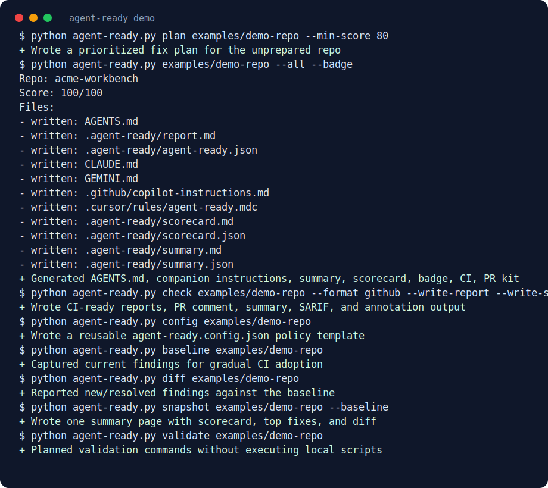

<div align="center">

# Agent Ready

**Make any repository ready for AI coding agents in one command.**

Turn a normal codebase into an agent-friendly workspace with shared instructions,
readiness scoring, GitHub annotations, PR artifacts, CI gates, and a public badge.

<p>
  <a href="https://github.com/hao0401/agent-ready/actions/workflows/test.yml"></a>
  <a href="https://github.com/hao0401/agent-ready/actions/workflows/action-smoke.yml"></a>
  
  
  
  <a href="LICENSE"></a>
</p>

<p>
  <a href="#quick-start"><strong>Quick Start</strong></a> ·
  <a href="#real-demo"><strong>Demo</strong></a> ·
  <a href="#github-action"><strong>GitHub Action</strong></a> ·
  <a href="#command-reference"><strong>Commands</strong></a> ·
  <a href="#codex-skill"><strong>Codex Skill</strong></a>
</p>



</div>

## What It Does

`agent-ready` scans a repository and writes the context AI coding agents need
before they touch code. It supports Codex, Claude Code, Cursor, Gemini CLI, and
GitHub Copilot from the same repository scan.

| Problem in a normal repo | What Agent Ready adds |
| --- | --- |
| Agents guess install, test, build, and lint commands | Detected commands are written into `AGENTS.md` and reports |
| Tool-specific instruction files drift | Codex, Claude, Gemini, Cursor, and Copilot files share one source scan |
| Risky instructions or fake secrets hide in docs | Prompt-injection and secret-looking findings include file and line context |
| CI failures do not explain what to fix first | Scorecard, summary, PR comment, SARIF, and prioritized fix plan are generated |
| Gradual adoption is hard to measure | Baselines, diffs, and score ratchets distinguish existing debt from regressions |

## Quick Start

Install from GitHub:

```powershell
pipx install git+https://github.com/hao0401/agent-ready.git
agent-ready . --all --badge
```

Or run from a cloned checkout:

```powershell
python .\agent-ready.py . --all --badge
python -m agent_ready . --all --badge
```

That one command creates agent instruction files, score reports, CI artifacts,
PR-ready output, and an Agent Ready badge for your `README.md`.

## Real Demo

The repo includes a reproducible example and generated showcase artifacts.

| Start here | Output |
| --- | --- |
| [`examples/demo-repo`](examples/demo-repo) | Example repository before Agent Ready |
| [`examples/demo-output/summary.md`](examples/demo-output/summary.md) | One-page readiness snapshot |
| [`examples/demo-output/scorecard.md`](examples/demo-output/scorecard.md) | Explainable `0-100` score breakdown |
| [`examples/demo-output/report.md`](examples/demo-output/report.md) | Full generated readiness report |
| [`examples/demo-output/plan.md`](examples/demo-output/plan.md) | Prioritized P0/P1/P2 fix plan |
| [`examples/demo-output/before-after.md`](examples/demo-output/before-after.md) | Before/after transformation |
| [`examples/demo-output/pr-comment.md`](examples/demo-output/pr-comment.md) | PR bot comment body |
| [`examples/demo-output/check.sarif`](examples/demo-output/check.sarif) | SARIF output for GitHub code scanning |

Visual assets:

- Static screenshot: [`assets/terminal-demo.png`](assets/terminal-demo.png)
- Animated terminal GIF: [`assets/terminal-demo.gif`](assets/terminal-demo.gif)
- Terminal SVG: [`assets/terminal-demo.svg`](assets/terminal-demo.svg)

Regenerate the demo:

```powershell
python -m pip install Pillow
python .\scripts\build_demo_assets.py --require-images
```

Example output:

```text
Repo: acme-workbench
Score: 100/100

Files:
- written: AGENTS.md
- written: CLAUDE.md
- written: GEMINI.md
- written: .github/copilot-instructions.md
- written: .cursor/rules/agent-ready.mdc
- written: .agent-ready/report.md
- written: .github/workflows/agent-ready.yml
- updated: README.md
```

## Differentiated Features

| Area | Feature |
| --- | --- |
| Scoring | Visible Agent Ready score, explainable scorecard, README badge, CI threshold |
| Multi-agent setup | `AGENTS.md`, `CLAUDE.md`, `GEMINI.md`, Cursor rules, Copilot instructions |
| Safety | Safe-by-default writes, prompt-injection scan, redacted secret-looking findings |
| CI adoption | Baseline mode, baseline diff, score ratchet, GitHub annotations, SARIF |
| Review workflow | PR comment, PR body, patch package, summary, fix plan |
| Local guidance | Doctor mode, dry-run validation, command truthing, monorepo map |
| Extensibility | Project config, MCP recommendations, repo-specific Codex skill generator |

## GitHub Action

The root [`action.yml`](action.yml) is a composite action with typed inputs,
outputs, PR comments, workflow summaries, SARIF support, and Marketplace
branding.

```yaml
name: Agent Ready

on:
  pull_request:
  push:
    branches: [main, master]

permissions:
  contents: read
  issues: write
  security-events: write

jobs:
  agent-ready:
    runs-on: ubuntu-latest
    steps:
      - uses: actions/checkout@v4
      - uses: hao0401/agent-ready@v1
        id: agent_ready
        with:
          path: .
          min-score: "80"
          format: github
          write-report: "true"
          write-summary: "true"
          write-comment: "true"
          write-plan: "true"
          write-diff: "true"
          sarif: "true"
          post-comment: "true"
      - name: Upload Agent Ready SARIF
        if: always() && steps.agent_ready.outputs.sarif-path != ''
        uses: github/codeql-action/upload-sarif@v4
        with:
          sarif_file: ${{ steps.agent_ready.outputs.sarif-path }}
          category: agent-ready
```

Reusable outputs include `passed`, `score`, `report-path`, `summary-path`,
`comment-path`, `plan-path`, `diff-path`, `sarif-path`, `config-path`,
`baseline-path`, `baseline-score`, `ratchet`, and `exit-code`.

## What It Generates

<details>
<summary>Generated files</summary>

- `AGENTS.md`
- `CLAUDE.md`
- `GEMINI.md`
- `.github/copilot-instructions.md`
- `.cursor/rules/agent-ready.mdc`
- `.agent-ready/report.md`
- `.agent-ready/agent-ready.json`
- `.agent-ready/summary.md`
- `.agent-ready/summary.json`
- `.agent-ready/pr-comment.md`
- `.agent-ready/pr-comment.json`
- `.agent-ready/scorecard.md`
- `.agent-ready/scorecard.json`
- `.agent-ready/check.md`
- `.agent-ready/check.json`
- `.agent-ready/check.sarif`
- `.agent-ready/plan.md`
- `.agent-ready/plan.json`
- `.agent-ready/diff.md`
- `.agent-ready/diff.json`
- `.agent-ready/baseline.json`
- `agent-ready.config.json`
- `.agent-ready/demo.md`
- `.agent-ready/validation.md`
- `.agent-ready/mcp-recommendations.md`
- `.agent-ready/skills/<repo>-workflow/SKILL.md`
- `.agent-ready/pr/PR_BODY.md`
- `.agent-ready/pr/agent-ready.patch`
- `.github/workflows/agent-ready.yml`

</details>

## Command Reference

Default one-command path:

```powershell
python .\agent-ready.py C:\path\to\repo --all --badge
```

<details>
<summary>Common commands</summary>

Scan only:

```powershell
python .\agent-ready.py scan C:\path\to\repo
```

Generate core files:

```powershell
python .\agent-ready.py generate C:\path\to\repo
```

Write an explainable score breakdown:

```powershell
python .\agent-ready.py scorecard C:\path\to\repo
```

Write a one-page summary:

```powershell
python .\agent-ready.py snapshot C:\path\to\repo
```

Create a prioritized fix plan:

```powershell
python .\agent-ready.py plan C:\path\to\repo --min-score 80
```

Create a starter config:

```powershell
python .\agent-ready.py config C:\path\to\repo
```

Capture and compare a baseline:

```powershell
python .\agent-ready.py baseline C:\path\to\repo
python .\agent-ready.py diff C:\path\to\repo
python .\agent-ready.py check C:\path\to\repo --baseline
python .\agent-ready.py check C:\path\to\repo --baseline --ratchet
```

Preview validation commands before running them:

```powershell
python .\agent-ready.py validate C:\path\to\repo --dry-run
```

Run a read-only CI check:

```powershell
python .\agent-ready.py check C:\path\to\repo --min-score 80
python .\agent-ready.py check C:\path\to\repo --min-score 80 --format github --write-report --write-summary --write-comment --write-scorecard --write-plan
python .\agent-ready.py check C:\path\to\repo --baseline --write-diff
python .\agent-ready.py check C:\path\to\repo --min-score 80 --write-sarif
python .\agent-ready.py check C:\path\to\repo --config agent-ready.config.json
```

Diagnose local setup:

```powershell
python .\agent-ready.py doctor C:\path\to\repo
```

Create a PR-ready package:

```powershell
python .\agent-ready.py pr C:\path\to\repo
```

Overwrite existing generated files only when intended:

```powershell
python .\agent-ready.py C:\path\to\repo --force
```

</details>

## Configuration

```json
{
  "check": {
    "min_score": 80,
    "require_agents": true,
    "baseline": ".agent-ready/baseline.json",
    "ratchet": false
  },
  "ignore_findings": [
    {
      "kind": "prompt-injection",
      "path": "docs/known-safe-example.md",
      "message_contains": "Prompt-injection-like instruction found"
    }
  ]
}
```

## Agent Readiness Score

The report gives a `0-100` score based on:

- Detected languages, configs, entry points, and project map.
- Detected run, test, build, lint, and typecheck commands.
- Presence of primary agent instructions.
- Prompt-injection findings.
- Secret-looking findings.
- Conflicting package manager or command guidance across agent files.

## Local Development

From the `agent-ready` directory:

```powershell
python -B scripts\dev.py test check release clean
python -B scripts\dev.py publish-check
```

If `make` is available:

```powershell
make test
make check
make build
make clean
make publish-check
```

Project references:

- License: [`LICENSE`](LICENSE)
- Contributing guide: [`CONTRIBUTING.md`](CONTRIBUTING.md)
- Security policy: [`SECURITY.md`](SECURITY.md)
- Package config: [`pyproject.toml`](pyproject.toml)
- GitHub Action: [`action.yml`](action.yml)
- GitHub workflows: [`.github/workflows`](.github/workflows)

## Codex Skill

This repository is also a Codex skill. Install or place the `agent-ready` folder
in your Codex skills directory, then ask:

```text
Use $agent-ready to scan this repository, generate agent instruction files, and report its agent readiness score.
```

## Design Goals

- No runtime dependencies.
- Safe by default: existing files are skipped unless `--force` is passed.
- Useful output even before generation.
- Works on Windows, macOS, and Linux.
- Small enough for agents to understand and modify.
